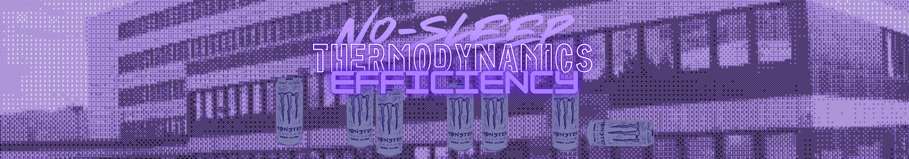
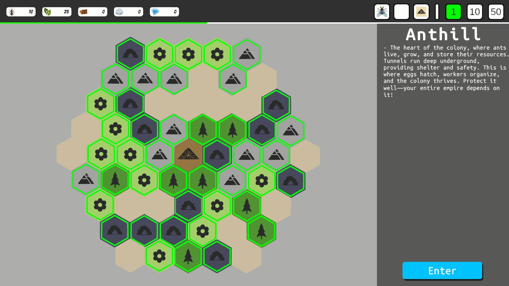
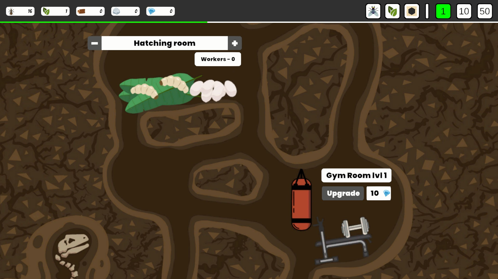

# HexAnt - GameJamNext25

Build and manage your own ant colony in a hexagonal world! Gather resources, expand your nest, and keep your colony thriving while maintaining balance among your workers. But be careful your resources are limited! Once all biomes are depleted, your colony's fate is sealed.

Made in 48h for the GGJ Next 2025 - Stribrniky v4 GameJam. Theme was peaceformers. Game is about resource management and balance in a colony of ants.

## No-Sleep Thermodynamic Efficiency

- [Janxyxy](https://github.com/Janxyxy)
- [Bagros](https://github.com/LosBagros)
- [Gary](https://github.com/gary1471/)
- [Lookup](https://github.com/LookupCz)

## Images

## 🔧 Development

- **Engine:** Unity 6
- **Programming Language:** C#
- **Platform:** Windows, TODO: WebGL

## Links

- [Itch.io](https://bagros.itch.io/hexant)
- [Colony Ranking](https://colony.nasypal.cz/)
- [GGJ Next 2025 - Stribrniky v4](https://itch.io/jam/4-stbrnick-gamejam/entries)
